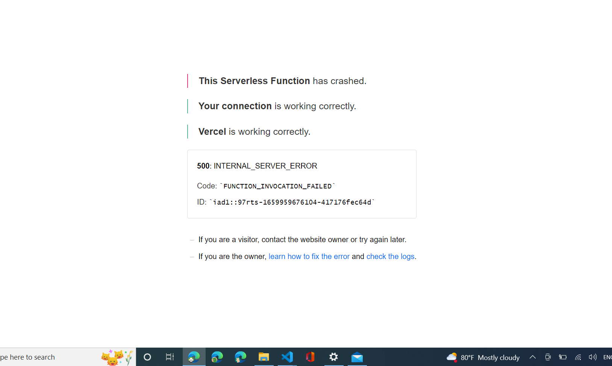
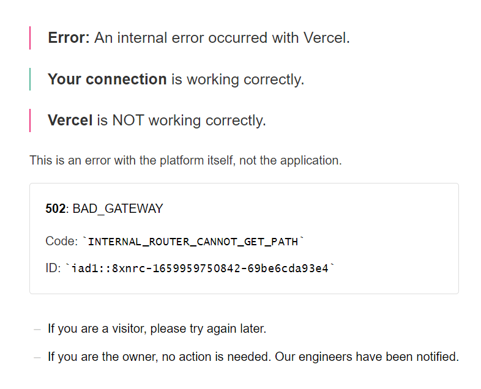

<!--- Provide a general summary of the issue in the Title above -->

## Expected Behavior

<!--- Tell us what should happen -->
* I should be able to deploy  the flask app to vercel and it should work sucessfully. 

## Current Behavior

<!--- Tell us what happens instead of the expected behavior -->
I get these errors



## Possible Solution

* I need guidance to help vercel treat my app not as a serverless function but a wsgi app


## Steps to Reproduce


1. update vercel.json
```json
{
  "version": 2,
  "public":true,
  "builds": [
      {
          "src": "index.py",
          "use": "@vercel/python"
      }
  ],
  "routes": [
      {
          "src": "/(.*)",
          "dest": "index.py"
      }
  ]
}
```
2. npx vercel deploy
3.
4.

## Environment
|property|value|data|
|:------|:------:|------|
|Vercel CLI| v27.3.7||
|local python env|3.10.6||
|vercel python|@vercel/python||
|flask|2.2.1||
||||
||||

## Files
<!-- paste snippets as well as upload files -->


<!--- How has this issue affected you? What are you trying to accomplish? -->
<!--- Providing context helps us come up with a solution that is most useful in the real world -->

<!--- Provide a general summary of the issue in the Title above -->

## Detailed Description
<!--- Provide a detailed description of the change or addition you are proposing -->

## Possible Implementation
<!--- Not obligatory, but suggest an idea for implementing addition or change -->
